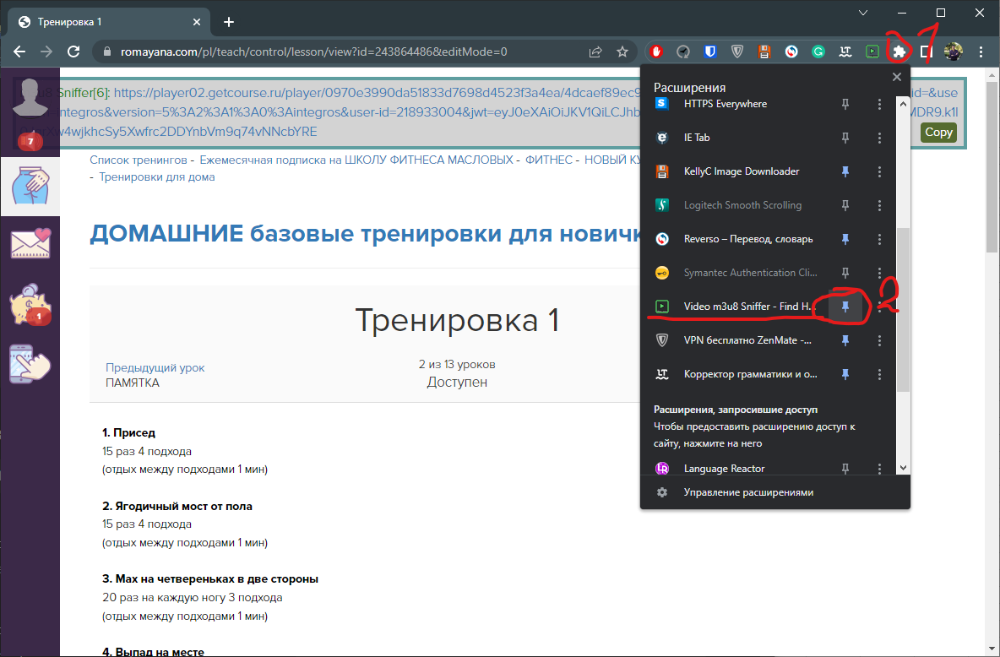

# Инструкция по скачиванию нескольких файлов m3u8

## 1. Устанавливаем расширение [Video m3u8 Sniffer](https://chrome.google.com/webstore/detail/video-m3u8-sniffer-find-h/akkncdpkjlfanomlnpmmolafofpnpjgn) для хрома

1. Переходим по ссылке [Video m3u8 Sniffer](https://chrome.google.com/webstore/detail/video-m3u8-sniffer-find-h/akkncdpkjlfanomlnpmmolafofpnpjgn)
1. Нажимаем ```Установить```

## 2. Устанавливаем модуль Import Excel и разрешить выполнять скрипты в PowerShell
1. Нажимаем пуск
1. Начинаем набирать текст PowerShell
1. Откроется поиск и найдет PowerShell
1. Справа будут варианты запуска, вибыраем запустить от имени администратора

    
1. Если спросит разрешение на запуск от админа, нажимаем ДА

    
1. В открывшемся окне вводим команду ```Install-Module ImportExcel``` и нажимаем Enter

    
1. Нас попросят подтвердить установку, вводим ```A``` (разрешить все) и нажимаем Enter

    
1. Идет установка

    
1. Когда она завершиться (не будет никаких всплывающих окон об окончании, просто пропадет шкала прогресса), вводим следующую команду ```Set-ExecutionPolicy Bypass``` и нажимаем Enter

    
1. Спросит подтверждение, снова вводим ```A``` и нажимаем Enter

    
1. После этого можно закрыть окно PowerShell

## 3. Установка ffmpeg и прописывание пути в PATH

1. Качаем архив с ffmpeg по ссылке [ffmpeg](https://www.gyan.dev/ffmpeg/builds/ffmpeg-git-full.7z)
1. Разархивируем в любую папку, но для удобства можно создать отдельную, представим что это будет папка ```D:\ffmpeg```
1. После разархивирования папка будет выглядеть как то так

    
1. Заходим внутрь папки ```ffmpeg-2022-08-31-git-319e8a49b5-full_build``` и внутри нее в папку bin

    
1. Копируем путь, в нашем случае это получился ```D:\ffmpeg\ffmpeg-2022-08-31-git-319e8a49b5-full_build\bin```
1. Теперь нам надо добавить путь этой папки в список путей где система ищет программы.

    Для этого открываем Пуск и начинаем вводить текст "```переменных```", и в результатах поиска кликаем по ```Изменение системных переменных среды```

    
1. В открывшемся окне ```Свойства системы``` кликаем по кнопке ```Переменные среды...```

    
1. Откроется окно ```Переменные среды``` тут кликаем один раз на переменную ```Path``` и нажимаем кнопку ```Изменить```

    
1. В окне ```Изменить переменную среды``` нажимаем ```Создать``` вводим наш путь ```D:\ffmpeg\ffmpeg-2022-08-31-git-319e8a49b5-full_build\bin``` и после этого нажимаем ```ОК```

    
1. После этого во всех остальных окнах нажимаем ```ОК```

## 4. Подготовка папки и таблицы со ссылками на нужные нам видео

1. Для удобства создадим папку под курсы, к примеру ```D:\Курсы Тони```
1. В этой папке создадим excel файл, назовем его ```ссылки.xlsx```

    
1. Открыв его заполняем первые 2 столбца текстом ```name``` и ```link```

    
1. Теперь идем на сайт с нашими курсами и открываем нужный нам видео урок. Попав на страницу смотрим есть ли сверху в списке расширений браузера значок ```Video m3u8 Sniffer```. Если нет то чтоб его закрепить нажимаем на значек пазла, и в выпавшем списке расширений ищем ```Video m3u8 Sniffer``` и нажимаем на кнопку булавки

    
1. Теперь нажимаем на значек расширения и вы выпавшем меню нажимаем ```Copy First```, что бы скопировать ссылку на первое видео на странице.

    
1. Полученную ссылку вставляем в нашу таблицу в столбец ```link``` и в стоблец ```name``` пишем имя, котрое мы хотим дать скачиваемому видео, и обязательно (!) в конце имени пишем ```.mp4```

    
1. Возвращаемся на страницу и теперь нажимаем ```Copy Last``` что бы скопировать ссылку на второе видео. Так же вставляем ссылку в таблицу как на шаге 6 
1. Повторяем этот шаги 5 и 6 со всеми нужными нам записями с курса
1. Закончив заполнять файл, сохраняем его и закрываем
1. Теперь создадим папку под этот курс, к примеру ```Какой-то курс```

    
1. Заходим в папку и копируем путь

    

## 5. Скачивание

1. Для удобства сохраняем [скрипт](./%D0%BF%D1%80%D0%BE%D1%81%D1%82%D0%BE%D0%B9%20%D1%81%D0%BA%D1%80%D0%B8%D0%BF%D1%82%20%D0%B4%D0%BB%D1%8F%20%D1%81%D0%BA%D0%B0%D1%87%D0%BA%D0%B8.ps1) для скачивание в папку ```D:\Курсы Тони```

    
1. Нажимаем на него правой кнопкой мыши в и кликаем ```Изменить```

    
1. Откроется редактор скриптов, тут нам нужно заполнить первые два пункта.
    - В первый пишем путь до папки куда качать видео, в нашем случае это путь скопированный ранее ```D:\Курсы Тони\Какой-то курс```
    - Во второй пункт пишем путь до файла со ссылками ```D:\Курсы Тони\ссылки.xlsx```
    - Ничего больше не меняем и нажимаем на иконку сохранения

    

1. И наконец то можем запустить скачивание нажав на кнопку ```Выпонить сценарий``` (Зеленая кнопка плей)

    
1. Начнется скачивание, это займет какое то время, в зависимости от количества файлов и их размера. В консоли будет бежать красный текст, на это можно не обращать внимание.

    
1. Скачивание завершилось, полоса прогресса пропала и текст больше не бежит

    
1. Теперь мы можем зайти в нашу папку ```D:\Курсы Тони\Какой-то курс``` и увидеть скачанные уроки

    
1. Profit!


## Заключение

В дальнейшем для скачивания новых видео нужно будет повторять шаги 4 и 5 заполняя новыми ссылками таблицу в Excel и по желанию меняя папку назначения. 